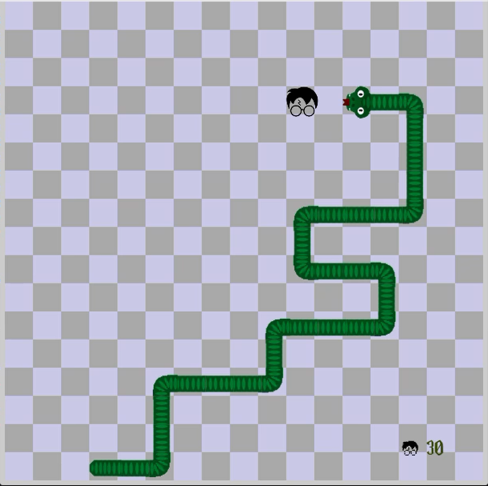

## Nagini: A Harry Potter-Inspired Snake Game

## Inspiration and Project Context

Nagini is not just a classic snake game—it's a tribute to the magical world of Harry Potter. As an avid fan of both Python programming and J.K. Rowling's wizarding universe, I set out to combine my passions into a single, fun project. The idea was to create an immersive gaming experience where players control Nagini, the serpent companion of Voldemort, navigating through a maze of challenges to "consume" Harry Potter-themed fruits.

## Technical Challenges and Solutions

- **Game Mechanics:** The core challenge was implementing traditional snake mechanics while integrating Harry Potter-themed visuals seamlessly. Each aspect of the game—from snake movement to fruit spawning—had to align with Python's Pygame library capabilities, ensuring smooth gameplay and visual appeal.

- **Algorithmic Design:** One of the technical highlights was designing the snake's movement algorithm using vector mathematics from Pygame's Vector2 module. This allowed precise control over Nagini's directional movement, crucial for avoiding collisions and growing in length upon consuming "Harry Potter" fruits.

- **Visual and Audio Integration:** Bringing the Harry Potter theme to life involved integrating custom graphics and sound effects. This included designing unique sprites for Nagini, Harry Potter fruits, and background elements, alongside incorporating sound effects like the iconic "crunch" when Nagini consumes a fruit.

## Struggles and Iterations

Throughout development, I encountered challenges with optimizing game performance, refining collision detection, and balancing gameplay difficulty. Iterative testing and user feedback played a pivotal role in fine-tuning these aspects, ensuring a satisfying and challenging gaming experience.

## Future Iterations

For future iterations, I envision enhancing Nagini with additional features such as:

- **Multiplayer Mode:** Introducing a competitive or cooperative multiplayer option.
- **Enhanced Visual Effects:** Adding animations or visual effects to further immerse players in the Harry Potter universe.
- **Community Features:** Integrate social features such as leaderboards, achievements, and player-generated content sharing to foster a vibrant Nagini community.

## Features

- Classic snake game mechanics
- Harry Potter-themed visuals
- Score tracking

## Screenshot



Screenshot of Nagini game in action.

## Installation

To play Nagini, you'll need to have Python installed on your computer. You can download Python from [python.org](https://www.python.org/).

### Clone the Repository

```bash
git clone https://github.com/yourusername/nagini.git
cd nagini
pip install pygame
```

To start the game, navigate to the project directory and run:

```bash
python nagini.py
```

## How to Play

- Use the arrow keys to control Nagini's direction.
- Eat the Harry Potter icons to grow longer and increase your score.
- Avoid running into the walls or Nagini's own body.
- The game ends when Nagini collides with the walls or itself.

## Contributing

Contributions are welcome! If you'd like to contribute to the project, please follow these steps:

1. Fork the repository.
2. Create a new branch (git checkout -b feature-branch).
3. Make your changes.
4. Commit your changes (git commit -m 'Add some feature').
5. Push to the branch (git push origin feature-branch).
6. Create a new Pull Request.

## Copyright and Disclaimer

This game is inspired by the Harry Potter series by J.K. Rowling. All Harry Potter-related content, including characters, names, and images, are the property of their respective owners. This project is intended for educational and entertainment purposes only. It is not affiliated with or endorsed by J.K. Rowling, Warner Bros., or any other official entity associated with the Harry Potter series.

## Contact

If you have any questions or feedback, feel free to reach out to me:

- **Email:** almassrynada411@gmail.com
- **GitHub:** n-elmasry

## Acknowledgements

Special thanks to the Pygame community for their excellent library.
Inspired by the Harry Potter series by J.K. Rowling.

Enjoy playing Nagini!
